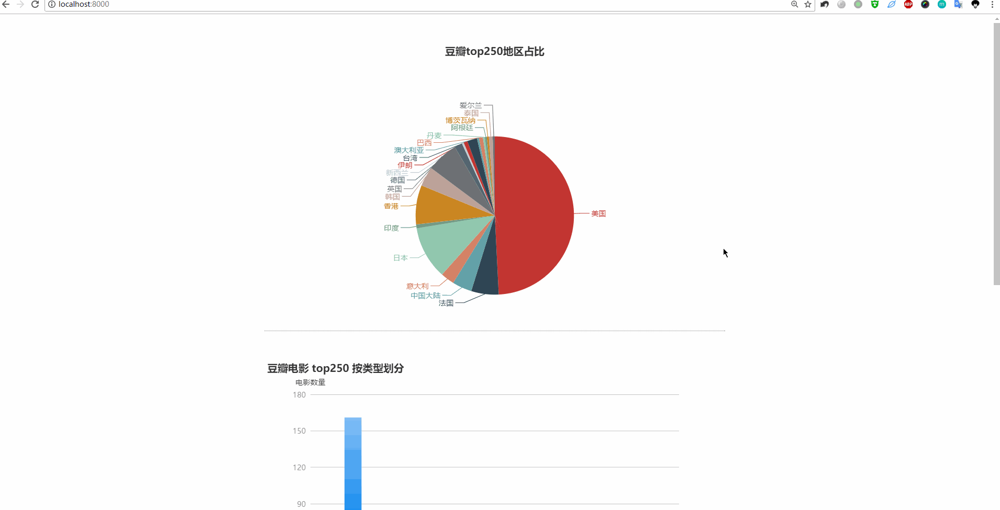

# doubanCrawler
A douban movie crawler and data visualization app

# 效果展示

==================================================================================================================================================================

# 注意事项
本软件运行前需要安装 Node.js，下载地址：http://nodejs.cn/download/ ，请根据实际情况选择相应版本下载安装。

# 运行步骤
1 打开命令提示符窗口`cmd`或终端；

2 用`cd`命令将当前目录路径设置为本文件（README.md）所在的目录；

3 在终端中输入：`node app.js`，然后回车；

4 等待一小会儿后，看到终端中显示 “`服务器已启动，访问地址为 http://:8000`” ，即表明服务器已启动；

5 打开浏览器，在地址栏中输入：`localhost:8000`，即可访问该页面。

# Tip
建议使用 Chrome 浏览器
